# Patrón Bridge - Sistema de Notificaciones (TypeScript)

## Tipo de Patrón
**ESTRUCTURAL - BRIDGE (PUENTE)**

## Descripción

Esta aplicación es un sistema de notificaciones multi-plataforma desarrollado en TypeScript, diseñado siguiendo principios de diseño orientados a separar la abstracción de la implementación y mejorar la escalabilidad del sistema.
En lugar de crear clases específicas para cada combinación de tipo de notificación y plataforma (NotificacionAlertaEmail, NotificacionAlertaMovil, NotificacionMensajeEmail, etc.), la aplicación separa los tipos de notificaciones de las plataformas de envío, permitiendo que ambas dimensiones evolucionen independientemente.
Este enfoque está inspirado en el Patrón de Diseño Bridge.

## Escenario

Una empresa necesita enviar diferentes tipos de notificaciones (alertas, mensajes, confirmaciones) a través de múltiples plataformas (Email, Móvil, Web, Escritorio). Sin una arquitectura adecuada, esto genera:

Explosión combinatoria de clases (N tipos × M plataformas = N×M clases)
Duplicación de código entre implementaciones similares
Rigidez al agregar nuevos tipos o plataformas
Acoplamiento fuerte entre la lógica de negocio y la tecnología

## Problema que Resuelve

Sin el patrón Bridge:
Explosión de clases: Cada combinación requiere una nueva clase concreta.
Código duplicado: La lógica de cada plataforma se repite para cada tipo de notificación.
Difícil de mantener: Un cambio en una plataforma requiere modificar múltiples clases.
Imposible de escalar: Agregar una nueva plataforma o tipo requiere crear/modificar decenas de clases.

## ✅ Solución Implementada

Se separa el sistema en **dos jerarquías independientes**:

### 1️⃣ Jerarquía de Abstracción (Tipos de Notificaciones)
Define **QUÉ** se envía:
* `Notificacion` (clase base abstracta)
  * `NotificacionAlerta` - Notificaciones de alerta urgente
  * `NotificacionMensaje` - Mensajes generales
  * `NotificacionConfirmacion` - Confirmaciones de acciones

### 2️⃣ Jerarquía de Implementación (Plataformas)
Define **CÓMO** se envía:
* `Plataforma` (interfaz)
  * `PlataformaEmail` - Envío vía correo electrónico (SMTP)
  * `PlataformaMovil` - Notificaciones push móviles
  * `PlataformaWeb` - Notificaciones en navegador (WebSocket)
  * `PlataformaEscritorio` - Notificaciones del sistema operativo

### Arquitectura Visual

```
✅ CON BRIDGE (Dos jerarquías independientes)

ABSTRACCIÓN                    IMPLEMENTACIÓN
(Tipos)                        (Plataformas)

Notificacion ═══════════════> Plataforma
├── NotificacionAlerta         ├── PlataformaEmail
├── NotificacionMensaje        ├── PlataformaMovil
└── NotificacionConfirmacion   ├── PlataformaWeb
                               └── PlataformaEscritorio

3 clases + 4 clases = 7 clases totales ✨
(vs 12 clases sin el patrón)
```

## Beneficios de esta Arquitectura

### 1. **Facilita el mantenimiento**
* Agregar una nueva plataforma solo requiere crear **1 clase** que implemente `Plataforma`
* Agregar un nuevo tipo de notificación solo requiere crear **1 clase** que extienda `Notificacion`

### 2. **Mejor organización del código**
* La lógica de negocio (tipos de notificaciones) está separada de los detalles técnicos (plataformas)
* Cada plataforma encapsula su propia lógica de conexión y validación

### 3. **Reduce la complejidad del sistema**
* Evita la explosión combinatoria de clases
* Elimina código duplicado entre implementaciones

### 4. **Promueve la reutilización**
* Una misma notificación puede enviarse por cualquier plataforma
* Una misma plataforma puede enviar cualquier tipo de notificación

### 5. **Facilita las pruebas**
* Puedes probar tipos de notificaciones independientemente de las plataformas
* Puedes probar plataformas independientemente de los tipos

## Mejores Prácticas Aplicadas

- ✅ **Separación de responsabilidades** - Cada archivo una responsabilidad
- ✅ **Principio SOLID** - SRP, OCP, DIP
- ✅ **Barrel Exports** - Exports organizados con index.ts
- ✅ **Estructura modular** - Código en carpetas lógicas
- ✅ **Type Safety** - TypeScript estricto
- ✅ **Clean Code** - Nombres descriptivos, funciones pequeñas

## 📐 Estructura del Proyecto

```
src/
├── types/              # Tipos centralizados
├── interfaces/         # Contratos del sistema
├── plataformas/        # Implementadores (CÓMO)
├── notificaciones/     # Abstracciones (QUÉ)
├── gestor/             # Gestión centralizada
├── index.ts            # Punto de entrada
└── demo.ts             # Demostración
```

##  Ejecución

```bash
npm install
npm start

# Modo desarrollo
npm run dev
```



```mermaid
---
title: Sistema de Notificaciones - Patrón Bridge
---
classDiagram
    %% ====================================
    %% JERARQUÍA DE ABSTRACCIÓN (Notificaciones)
    %% ====================================
    
    class Notificacion {
        <<abstract>>
        #plataforma: Plataforma
        +constructor(plataforma: Plataforma)
        +enviar() void
        +cambiarPlataforma(plataforma: Plataforma) void
    }
    
    class NotificacionAlerta {
        -titulo: string
        -mensaje: string
        -prioridad: string
        -usuario: string
        -timestamp: Date
        +constructor(plataforma: Plataforma, datos: DatosAlerta)
        +enviar() void
        -validarPrioridad() boolean
    }
    
    class NotificacionMensaje {
        -remitente: string
        -contenido: string
        -adjuntos: string[]
        -usuario: string
        -timestamp: Date
        +constructor(plataforma: Plataforma, datos: DatosMensaje)
        +enviar() void
        -procesarAdjuntos() void
    }
    
    class NotificacionConfirmacion {
        -accion: string
        -detalles: string
        -codigoConfirmacion: string
        -usuario: string
        -timestamp: Date
        +constructor(plataforma: Plataforma, datos: DatosConfirmacion)
        +enviar() void
        -generarCodigo() string
    }
    
    %% ====================================
    %% JERARQUÍA DE IMPLEMENTACIÓN (Plataformas)
    %% ====================================
    
    class Plataforma {
        <<interface>>
        +enviarNotificacion(datos: DatosNotificacion) ResultadoEnvio
        +validarFormato(datos: DatosNotificacion) boolean
        +obtenerEstadisticas() Estadisticas
    }
    
    class PlataformaEmail {
        -servidorSMTP: string
        -puerto: number
        -usuarioSMTP: string
        +enviarNotificacion(datos: DatosNotificacion) ResultadoEnvio
        +validarFormato(datos: DatosNotificacion) boolean
        +obtenerEstadisticas() Estadisticas
        -configurarSMTP() void
        -validarEmail(email: string) boolean
    }
    
    class PlataformaMovil {
        -servicioNotificaciones: string
        -apiKey: string
        -certificado: string
        +enviarNotificacion(datos: DatosNotificacion) ResultadoEnvio
        +validarFormato(datos: DatosNotificacion) boolean
        +obtenerEstadisticas() Estadisticas
        -configurarPush() void
        -validarToken(token: string) boolean
    }
    
    class PlataformaWeb {
        -websocketURL: string
        -conexionActiva: boolean
        +enviarNotificacion(datos: DatosNotificacion) ResultadoEnvio
        +validarFormato(datos: DatosNotificacion) boolean
        +obtenerEstadisticas() Estadisticas
        -configurarWebSocket() void
        -mantenerConexion() void
    }
    
    class PlataformaEscritorio {
        -sistemaOperativo: string
        -nivelPermiso: string
        +enviarNotificacion(datos: DatosNotificacion) ResultadoEnvio
        +validarFormato(datos: DatosNotificacion) boolean
        +obtenerEstadisticas() Estadisticas
        -mostrarNotificacionSistema() void
        -verificarPermisos() boolean
    }
    
    %% ====================================
    %% INTERFACES Y TIPOS AUXILIARES
    %% ====================================
    
    class DatosNotificacion {
        <<interface>>
        +usuario: string
        +timestamp: Date
        +[key: string]: any
    }
    
    class ResultadoEnvio {
        <<interface>>
        +exitoso: boolean
        +mensaje: string
        +timestamp: Date
        +plataforma: string
    }
    
    class Estadisticas {
        <<interface>>
        +totalEnviados: number
        +exitosos: number
        +fallidos: number
        +tiempoPromedio: number
    }
    
    class ConfiguracionEmail {
        <<interface>>
        +destinatario: string
        +asunto: string
        +cuerpo: string
        +cc?: string[]
        +bcc?: string[]
    }
    
    %% ====================================
    %% RELACIONES
    %% ====================================
    
    %% Herencia en jerarquía de Abstracción
    Notificacion <|-- NotificacionAlerta : extends
    Notificacion <|-- NotificacionMensaje : extends
    Notificacion <|-- NotificacionConfirmacion : extends
    
    %% Implementación en jerarquía de Implementación
    Plataforma <|.. PlataformaEmail : implements
    Plataforma <|.. PlataformaMovil : implements
    Plataforma <|.. PlataformaWeb : implements
    Plataforma <|.. PlataformaEscritorio : implements
    
    %% Relación Bridge (Composición)
    Notificacion o-- Plataforma : usa >
    
    %% Dependencias con interfaces
    Plataforma ..> DatosNotificacion : usa
    Plataforma ..> ResultadoEnvio : retorna
    Plataforma ..> Estadisticas : retorna
    PlataformaEmail ..> ConfiguracionEmail : usa
    
    %% ====================================
    %% NOTAS Y ANOTACIONES
    %% ====================================
    
    note for Notificacion "ABSTRACCIÓN\nDefine QUÉ se envía\n(tipos de notificaciones)"
    note for Plataforma "IMPLEMENTACIÓN\nDefine CÓMO se envía\n(canales de entrega)"
    note for NotificacionAlerta "Notificaciones urgentes\ncon niveles de prioridad"
    note for NotificacionMensaje "Mensajes generales\ncon soporte para adjuntos"
    note for NotificacionConfirmacion "Confirmaciones de acciones\ncon códigos únicos"
    note for PlataformaEmail "Envío vía SMTP\nFormato: HTML/texto"
    note for PlataformaMovil "Push notifications\nFirebase/APNs"
    note for PlataformaWeb "WebSocket en tiempo real\nNotificaciones browser"
    note for PlataformaEscritorio "Notificaciones nativas\nWindows/macOS/Linux"

```

## Explicación del Diagrama

### 🔵 Jerarquía de Abstracción (Azul - Izquierda)
- **Notificacion**: Clase abstracta base que mantiene referencia a una Plataforma
- **NotificacionAlerta**: Notificaciones urgentes con prioridad
- **NotificacionMensaje**: Mensajes con adjuntos
- **NotificacionConfirmacion**: Confirmaciones con código único

### 🟡 Jerarquía de Implementación (Amarillo - Derecha)
- **Plataforma**: Interfaz que define el contrato
- **PlataformaEmail**: Implementación SMTP
- **PlataformaMovil**: Push notifications
- **PlataformaWeb**: WebSocket/SSE
- **PlataformaEscritorio**: Notificaciones del SO

### 🌉 Relación Bridge
La composición entre `Notificacion` y `Plataforma` es el **puente** que permite:
- Cambiar plataformas en tiempo de ejecución
- Agregar tipos sin modificar plataformas
- Agregar plataformas sin modificar tipos

### Ventajas Visualizadas
- **Sin Bridge**: 3 tipos × 4 plataformas = 12 clases
- **Con Bridge**: 3 + 4 + 1 base = 8 clases principales

---